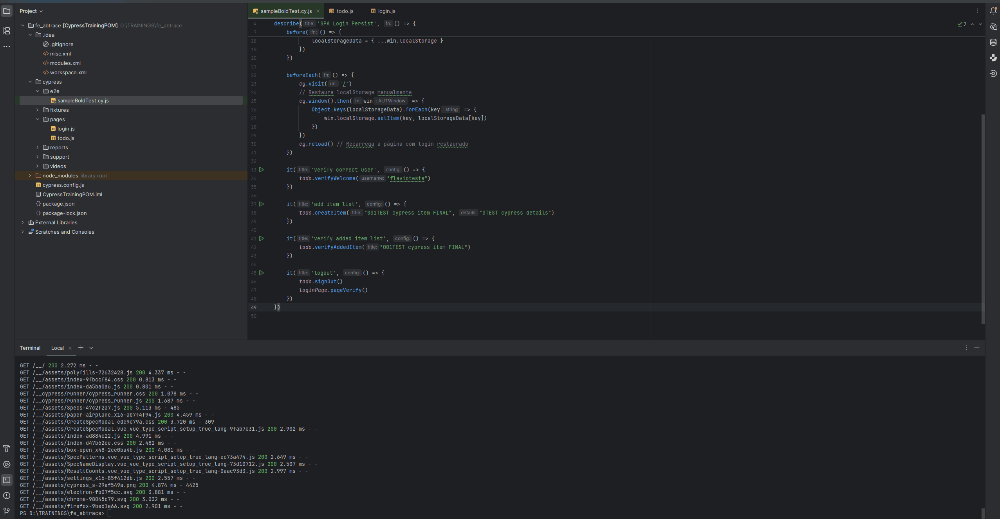

# Cypress End-to-End Testing Project

Este projeto utiliza **Cypress** para testes end-to-end (E2E) do front-end da aplicação.

---

## Requisitos

- Node.js >= 18
- NPM ou Yarn
- IDE recomendada: **Visual Studio Code** (VSCode)
- Navegador Chrome (para testes locais)

---

## Instalação

Clone o repositório e instale as dependências:

```bash
npm install

yarn install

npm install cypress
```

## To Run
```bash
npx cypress open
```

## IMPORTANT
A class bold sample de teste é: cypress/e2e/sampleBoldTest.cy.js

- Todos os testes podem receber data configuravel se desejado atravez dos respetivos métodos.
- Nota: alguns testes validam steps de testes anteriores logo deve ser tido em consideração
- O metodo "beforeEach" não deve ser alterado

## !! TEST RUN SHOW !!


